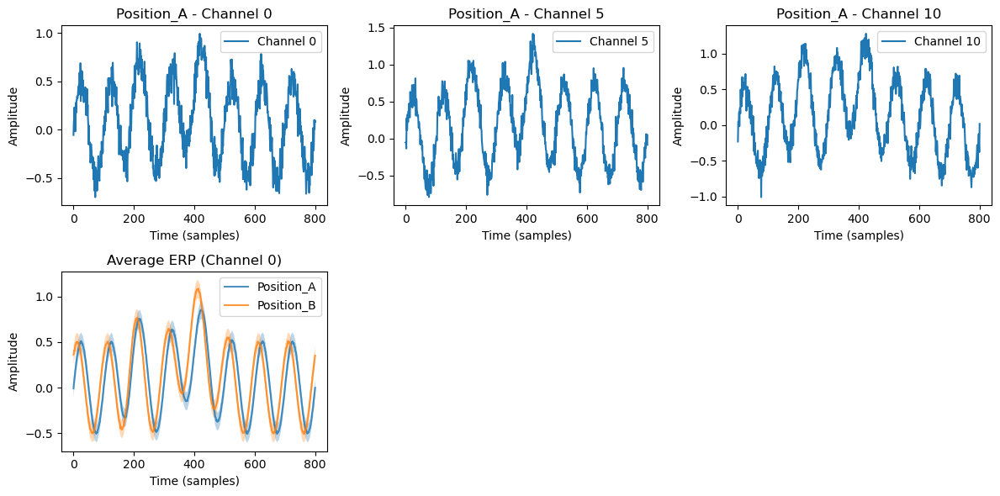
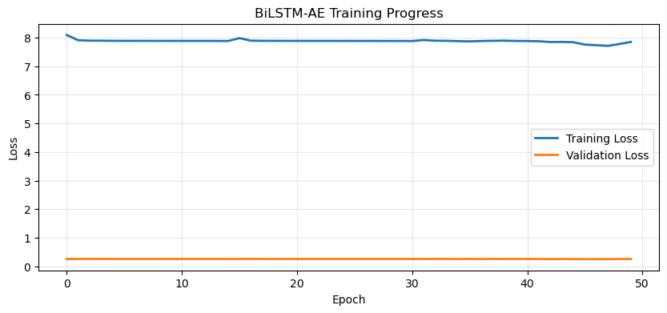

```python
import numpy as np
import torch
import torch.nn as nn
import torch.optim as optim
import matplotlib.pyplot as plt
from sklearn.decomposition import PCA
from sklearn.preprocessing import StandardScaler
import seaborn as sns
from mpl_toolkits.mplot3d import Axes3D
from tqdm import tqdm
```


```python
# synetic data
torch.manual_seed(42)
np.random.seed(42)

def generate_simulated_eeg_data(n_trials=1221, n_timesteps=801, n_channels=96):
    """
    generalize synthetic EEG data for two conditions (Position_A and Position_B) with distinct temporal dynamics and channel-specific patterns.
    """
    print(f"generalize synthetic data: {n_trials} trials, {n_timesteps}time points, {n_channels} channels")
    
    
    data = np.zeros((n_trials, n_timesteps, n_channels))
    labels = np.zeros(n_trials, dtype=int)  # 0=Position_A, 1=Position_B
    
    # parameters
    t = np.linspace(-100, 700, n_timesteps) / 1000.0  # seconds
    
    
    for trial in range(n_trials):
        # randomly select position label for each trial
        position_label = np.random.choice([0, 1])
        labels[trial] = position_label
        
    
        base_freq = 10  # Hz
        
        # different amplitude and phase for Position_A and Position_B
        if position_label == 0:  # Position_A
            
            early_amp = 1.5
            late_amp = 0.8
            phase_shift = 0
        else:  # Position_B
            
            early_amp = 1.0
            late_amp = 1.2
            phase_shift = np.pi/4  
        
        # generalize data for each channel
        for channel in range(n_channels):
            
            base_signal = np.sin(2 * np.pi * base_freq * t + phase_shift)
            
           
            n100 = 0.3 * np.exp(-((t - 0.1) ** 2) / (2 * 0.02 ** 2))
            
            
            p300 = 0.5 * np.exp(-((t - 0.3) ** 2) / (2 * 0.05 ** 2))
            
            # wieghts for different stages
            early_response = early_amp * n100
            late_response = late_amp * p300
            
            # combine all components
            signal = 0.5 * base_signal + early_response + late_response
            
            # distraction effect
            channel_mod = 0.1 * np.sin(2 * np.pi * (channel/10) * t)
            
            
            noise = 0.1 * np.random.randn(n_timesteps)
            
            # finnal signal
            data[trial, :, channel] = signal + channel_mod + noise
            
            # simulate functional connectivity by adding some channel-to-channel correlations
            if channel > 0:
                data[trial, :, channel] += 0.2 * data[trial, :, channel-1]
    
    print(f"Position_A trials: {np.sum(labels==0)}, Position_B trials: {np.sum(labels==1)}")
    return data, labels

# generalize data
data, labels = generate_simulated_eeg_data(n_trials=500, n_timesteps=801, n_channels=96)  # 使用较小数据集加速

plt.figure(figsize=(12, 6))
for i in range(3):  
    plt.subplot(2, 3, i+1)
    plt.plot(data[0, :, i*5], label=f'Channel {i*5}')
    plt.title(f'Position_{"A" if labels[0]==0 else "B"} - Channel {i*5}')
    plt.xlabel('Time (samples)')
    plt.ylabel('Amplitude')
    plt.legend()


plt.subplot(2, 3, 4)
mean_a = np.mean(data[labels==0, :, 0], axis=0)
mean_b = np.mean(data[labels==1, :, 0], axis=0)
plt.plot(mean_a, label='Position_A', alpha=0.8)
plt.plot(mean_b, label='Position_B', alpha=0.8)
plt.fill_between(range(len(mean_a)), mean_a-0.1, mean_a+0.1, alpha=0.3)
plt.fill_between(range(len(mean_b)), mean_b-0.1, mean_b+0.1, alpha=0.3)
plt.title('Average ERP (Channel 0)')
plt.xlabel('Time (samples)')
plt.ylabel('Amplitude')
plt.legend()

plt.tight_layout()
plt.show()


```

    生成模拟EEG数据: 500 trials, 801时间点, 96通道
    Position_A trials: 259, Position_B trials: 241


    

    


```python
class BiLSTM_AE(nn.Module):
    def __init__(self, input_dim=96, hidden_dim=64, latent_dim=3, num_layers=2):
        super(BiLSTM_AE, self).__init__()

        self.encoder_lstm = nn.LSTM(input_dim, hidden_dim, num_layers, batch_first=True, bidirectional=True, dropout=0.1)

        self.encoder_out = nn.Linear(hidden_dim*2, hidden_dim)
        self.latent = nn.Linear(hidden_dim, latent_dim)

        self.decoder_input = nn.Linear(latent_dim, hidden_dim)
        self.decoder_lstm = nn.LSTM(hidden_dim, hidden_dim, num_layers, batch_first=True, bidirectional=True, dropout=0.1)
        
        self.decoder_out = nn.Linear(hidden_dim*2, input_dim)

        # activation functions
        self.relu = nn.ReLU()
        self.tanh = nn.Tanh()

    def encode(self,x):
        lstm_out,(hidden,cell) = self.encoder_lstm(x) # lstm_out:(batch, seq_len, hidden_dim*2)

        last_output = lstm_out[:,-1,:] # (batch, hidden_dim*2)

        # put into latent space
        encoded = self.relu(self.encoder_out(last_output)) # (batch, hidden_dim)
        z = self.tanh(self.latent(encoded)) # (batch, latent_dim)

        return z, lstm_out

    def decode(self,z,seq_len):
        #expand batch_size to match seq_len
        batch_size = z.size(0)

        decoder_input = self.relu(self.decoder_input(z)) # (batch, hidden_dim)
        decoder_input = decoder_input.unsqueeze(1).repeat(1,seq_len,1) # (batch, seq_len, hidden_dim)

        lstm_out, _ = self.decoder_lstm(decoder_input) # (batch, seq_len, hidden_dim*2)

        reconstructed = self.decoder_out(lstm_out) # (batch, seq_len, input_dim)

        return reconstructed
    
    def forward(self,x):
        z, _ = self.encode(x)
        reconstructed = self.decode(z, x.size(1))
        return reconstructed, z


```


```python
# training & testing dataset prepared
data_tensor = torch.FloatTensor(data)
labels_tensor = torch.LongTensor(labels)

train_ratio = 0.8
n_train = int(len(data)*train_ratio)

indices = np.random.permutation(len(data))
train_indices = indices[:n_train]
test_indices = indices[n_train:]

train_data = data_tensor[train_indices]
train_labels = labels_tensor[train_indices]
test_data = data_tensor[test_indices]
test_labels = labels_tensor[test_indices]

print(f"training dataset:{len(train_data)}, testing dataset:{len(test_data)}")

train_dataset = torch.utils.data.TensorDataset(train_data, train_labels)
train_loader = torch.utils.data.DataLoader(train_dataset, batch_size=32, shuffle=True)
```

    training dataset:400, testing dataset:100


```python
device = torch.device("cuda" if torch.cuda.is_available() else "cpu")
print(f"Using device: {device}")

model = BiLSTM_AE(input_dim=96, hidden_dim=64, latent_dim=3, num_layers=2).to(device)

# loss functions and optimizers
criterion = nn.MSELoss()
optimizer = optim.Adam(model.parameters(), lr=0.001, weight_decay=1e-5)
scheduler = optim.lr_scheduler.StepLR(optimizer, step_size=10, gamma=0.5)
#scheduler = optim.lr_scheduler.ReduceROnPlateau(optimizer, mode='min', factor=0.5, patience=5)

n_epochs = 50
train_losses = []
val_losses=[]

print("Starting training...")
for epoch in range(n_epochs):
    model.train()
    epoch_loss = 0

    for batch_data, _ in train_loader:
        batch_data = batch_data.to(device)


        # forward pass
        reconstructed, _ = model(batch_data)
        loss = criterion(reconstructed, batch_data)

        # backward pass
        optimizer.zero_grad()
        loss.backward()
        torch.nn.utils.clip_grad_norm_(model.parameters(), max_norm=1.0)  # gradient clipping
        optimizer.step()

        epoch_loss += loss.item() * batch_data.size(0)

    avg_loss = epoch_loss / len(train_loader)
    train_losses.append(avg_loss)

 
    model.eval()
    with torch.no_grad():
        val_data = test_data.to(device)
        reconstructed_val, _ = model(val_data)
        val_loss = criterion(reconstructed_val, val_data).item()
        val_losses.append(val_loss)
    
    
    scheduler.step(val_loss)
    
    if (epoch + 1) % 10 == 0:
        print(f'Epoch [{epoch+1}/{n_epochs}], Train Loss: {avg_loss:.6f}, Val Loss: {val_loss:.6f}')


plt.figure(figsize=(10, 4))
plt.plot(train_losses, label='Training Loss', linewidth=2)
plt.plot(val_losses, label='Validation Loss', linewidth=2)
plt.xlabel('Epoch')
plt.ylabel('Loss')
plt.title('BiLSTM-AE Training Progress')
plt.legend()
plt.grid(True, alpha=0.3)
plt.show()

```

    Using device: cpu
    Starting training...
    Epoch [10/50], Train Loss: 7.887545, Val Loss: 0.256353
    Epoch [20/50], Train Loss: 7.888160, Val Loss: 0.256368
    Epoch [30/50], Train Loss: 7.884866, Val Loss: 0.256241
    Epoch [40/50], Train Loss: 7.886625, Val Loss: 0.256216
    Epoch [50/50], Train Loss: 7.850665, Val Loss: 0.254343


    

    

