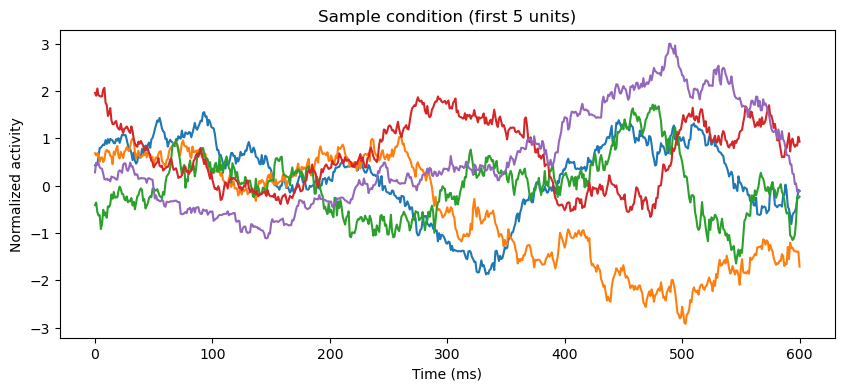
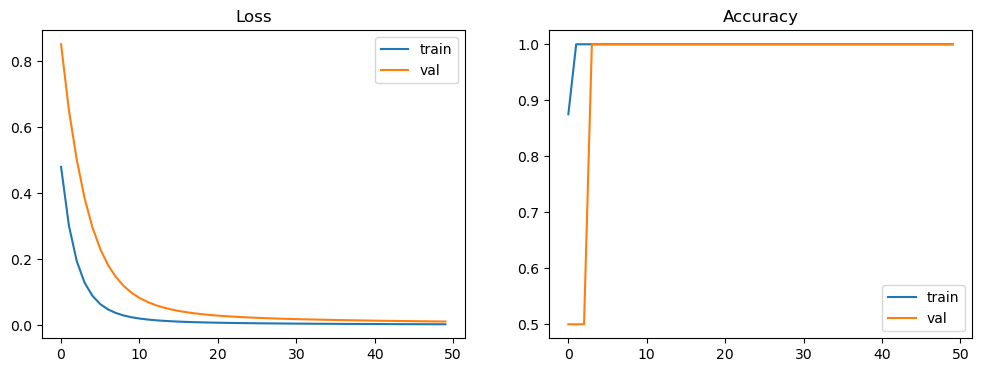
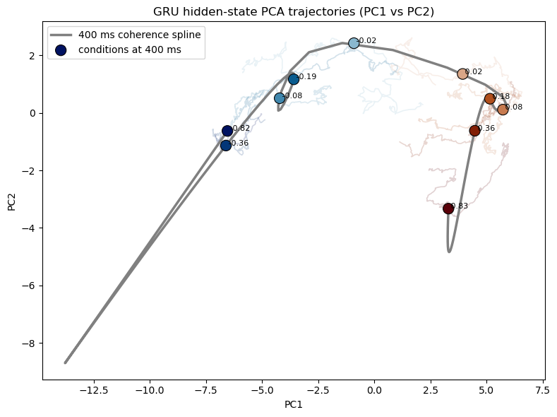

```python
import scipy.io as sio
import torch
import torch.nn as nn
import torch.optim as optim
import numpy as np
import matplotlib.pyplot as plt
from pathlib import Path
from torch.utils.data import TensorDataset, DataLoader, random_split
from sklearn.decomposition import PCA
```


```python
class ScratchGRU(nn.Module):
    def __init__(self, input_sz, hidden_sz):
        super().__init__()
        self.hidden_sz = hidden_sz

        # Combined weights for efficiency:[Update Gate, Reset Gate, Candidate Content]
        # We need 3 sets of weights for input and 3 for hidden state
        self.W = nn.Parameter(torch.Tensor(input_sz, 3 * hidden_sz))
        self.U = nn.Parameter(torch.Tensor(hidden_sz, 3 * hidden_sz))
        self.bias = nn.Parameter(torch.Tensor(3 * hidden_sz))
        self.init_weights()
    
    def init_weights(self):
        for p in self.parameters():
            if p.data.ndimension() >=2:
                nn.init.xavier_uniform_(p.data)
            else:
                nn.init.zeros_(p.data)
    
    def forward(self, x ,init_h = None):
        '''
        x shape: (batch_size, seq_len, input_sz)
        Returns: (all_hidden_states, last_hidden_state)
        '''
        bs, seq_sz,_ = x.size()
        hidden_seq = []
        if init_h is None:
            h_t = torch.zeros(bs, self.hidden_sz).to(x.device)
        else:
            h_t =init_h

        for t in range(seq_sz):
            x_t = x[:, t, :]  # (bs, input_sz)

            #linear transformations
            gate_x = x_t @ self.W + self.bias
            gate_h = h_t @ self.U

            # Split into gates
            i_r, i_i, i_n = gate_x.chunk(3,1)
            h_r, h_i, h_n = gate_h.chunk(3,1)

            # Reset Gate(r) & update Gate(z)
            reset_gate = torch.sigmoid(i_r +h_r)
            update_gate = torch.sigmoid(i_i + h_i)

            # New Memory Content(n)
            new_content = torch.tanh(i_n +(reset_gate * h_n))

            # Final hidden state
            h_t = (1 - update_gate) * new_content + update_gate * h_t
            hidden_seq.append(h_t.unsqueeze(1))  # (bs, 1, hidden_sz)
        
        hidden_seq = torch.cat(hidden_seq, dim=1)  # (bs, seq_sz, hidden_sz)
        return hidden_seq, h_t


```


```python
class GRUModel(nn.Module):
    def __init__(self, input_dim, hidden_dim, output_dim):
        super().__init__()
        self.gru = ScratchGRU(input_dim, hidden_dim)
        self.classifier = nn.Linear(hidden_dim, output_dim)

    def forward(self, x):
        all_h, last_h = self.gru(x)
        logits = self.classifier(last_h)
        return logits, all_h
```


```python
data_dir = Path("/Users/siyu/Documents/GitHub/My-Study-Notes/my-notes/notes/hand-coded-play/GRU/data/Okazawa_Cell_2021-master")
face_data = sio.loadmat(data_dir / "Face_cor.mat")
motion_data = sio.loadmat(data_dir / "Motion_cor.mat")
print("Face keys:", face_data.keys())
print("Face PSTH shape:", face_data["PSTH"].shape)
print("Face coherence shape:", face_data["coherence"].shape)
print("Face Tstamp shape:", face_data["Tstamp"].shape)
```

    Face keys: dict_keys(['__header__', '__version__', '__globals__', 'PSTH', 'PSTH_detrended', 'Tstamp', 'coherence', 'half_cutoff'])
    Face PSTH shape: (132, 801, 10)
    Face coherence shape: (132, 10)
    Face Tstamp shape: (1, 801)


```python
def build_dataset_from_mat(mat_dict, use_detrended=True):
    """
    mat_dict:
      PSTH / PSTH_detrended: (unit, time, condition)
      coherence:            (unit, condition)
    Return:
      X: (num_samples, seq_len, input_dim)
      y: (num_samples,)
      tstamp: (seq_len,)
      coh_values: (num_samples,)
    """
    psth_key = "PSTH_detrended" if use_detrended else "PSTH"
    psth = mat_dict[psth_key]                 # (unit, time, condition)
    coherence = mat_dict["coherence"]         # (unit, condition)
    tstamp = mat_dict["Tstamp"].squeeze()     # (time,)
    num_units, seq_len, num_conditions = psth.shape
    X_list = []
    y_list = []
    coh_list = []
    for c in range(num_conditions):
        x_c = psth[:, :, c].T   # (time, unit)
        coh_c = coherence[:, c].mean() / 100.0
        X_list.append(x_c)
        coh_list.append(coh_c)
        y_list.append(1 if coh_c > 0 else 0)
    X = np.stack(X_list, axis=0)   # (condition, time, unit)
    y = np.array(y_list, dtype=np.int64)
    coh_values = np.array(coh_list, dtype=np.float32)
    return X, y, tstamp, coh_values
```


```python
def preprocess_X(X, tstamp, t_min=0, t_max=600):
    """
    X: (N, T, D)
    """
    mask = (tstamp >= t_min) & (tstamp <= t_max)
    X = X[:, mask, :]
    mean = X.mean(axis=(0, 1), keepdims=True)
    std = X.std(axis=(0, 1), keepdims=True) + 1e-8
    X = (X - mean) / std
    return X, mask
```


```python
X_face, y_face, t_face, coh_face = build_dataset_from_mat(face_data, use_detrended=True)
X_face, time_mask = preprocess_X(X_face, t_face, t_min=0, t_max=600)
print("X_face shape:", X_face.shape)   # (num_samples, seq_len, input_dim)
print("y_face shape:", y_face.shape)
print("coherence values:", coh_face)
print("labels:", y_face)
```

    X_face shape: (10, 601, 132)
    y_face shape: (10,)
    coherence values: [ 0.8280064   0.35656807  0.18297046  0.08024874  0.01712902 -0.01749833
     -0.078899   -0.18640667 -0.35655433 -0.82167834]
    labels: [1 1 1 1 1 0 0 0 0 0]


```python
plt.figure(figsize=(10, 4))
plt.plot(t_face[time_mask], X_face[0, :, :5])   # plot first 5 units of the first sample
plt.xlabel("Time (ms)")
plt.ylabel("Normalized activity")
plt.title("Sample condition (first 5 units)")
plt.show()
```


    

    


```python
X_tensor = torch.tensor(X_face, dtype=torch.float32)
y_tensor = torch.tensor(y_face, dtype=torch.long)
dataset = TensorDataset(X_tensor, y_tensor)
train_size = int(0.8 * len(dataset))
val_size = len(dataset) - train_size
train_set, val_set = random_split(
    dataset,
    [train_size, val_size],
    generator=torch.Generator().manual_seed(42)
)
train_loader = DataLoader(train_set, batch_size=4, shuffle=True)
val_loader = DataLoader(val_set, batch_size=4, shuffle=False)
print("Train size:", len(train_set))
print("Val size:", len(val_set))
```

    Train size: 8
    Val size: 2


```python
input_dim = X_tensor.shape[-1]
hidden_dim = 64
output_dim = 2

device = torch.device("cuda" if torch.cuda.is_available() else "cpu")

model = GRUModel(input_dim, hidden_dim, output_dim).to(device)
criterion = nn.CrossEntropyLoss()
optimizer = optim.Adam(model.parameters(), lr=1e-3)
print(model)
```

    GRUModel(
      (gru): ScratchGRU()
      (classifier): Linear(in_features=64, out_features=2, bias=True)
    )


```python
def evaluate(model,loader,criterion,device):
    model.eval()
    total_loss = 0.0
    total_correct = 0
    total_sum = 0

    with torch.no_grad():
        for xb, yb in loader:
            xb, yb = xb.to(device), yb.to(device)
            
            logits, all_h = model(xb)
            loss = criterion(logits, yb)

            total_loss += loss.item() * xb.size(0)
            preds = logits.argmax(dim=1)
            total_correct += (preds == yb).sum().item()
            total_sum += xb.size(0)

    accuracy = total_correct / total_sum if total_sum > 0 else 0
    avg_loss = total_loss / total_sum if total_sum > 0 else 0

    return avg_loss, accuracy
```


```python
num_epochs = 50

train_losses = []
val_losses = []
train_accs = []
val_accs = []

for epoch in range(num_epochs):
    model.train()

    for xb, yb in train_loader:
        xb, yb = xb.to(device), yb.to(device)

        optimizer.zero_grad()
        logits, all_h = model(xb)
        loss = criterion(logits, yb)
        loss.backward()
        optimizer.step()

    train_loss, train_acc = evaluate(model, train_loader, criterion, device)
    val_loss, val_acc = evaluate(model, val_loader, criterion, device)
    train_losses.append(train_loss)
    val_losses.append(val_loss)
    train_accs.append(train_acc)
    val_accs.append(val_acc)

    if(epoch + 1) % 5 ==0:
        print(
            f'Epoch {epoch+1:03d} |'
            f'Train Loss: {train_loss:.4f} | Train Acc: {train_acc:.4f} |'
            f'Val Loss: {val_loss:.4f} | Val Acc: {val_acc:.4f}'
        )    
```

    Epoch 005 |Train Loss: 0.0893 | Train Acc: 1.0000 |Val Loss: 0.2966 | Val Acc: 1.0000
    Epoch 010 |Train Loss: 0.0241 | Train Acc: 1.0000 |Val Loss: 0.0983 | Val Acc: 1.0000
    Epoch 015 |Train Loss: 0.0121 | Train Acc: 1.0000 |Val Loss: 0.0480 | Val Acc: 1.0000
    Epoch 020 |Train Loss: 0.0081 | Train Acc: 1.0000 |Val Loss: 0.0311 | Val Acc: 1.0000
    Epoch 025 |Train Loss: 0.0062 | Train Acc: 1.0000 |Val Loss: 0.0235 | Val Acc: 1.0000
    Epoch 030 |Train Loss: 0.0051 | Train Acc: 1.0000 |Val Loss: 0.0192 | Val Acc: 1.0000
    Epoch 035 |Train Loss: 0.0043 | Train Acc: 1.0000 |Val Loss: 0.0163 | Val Acc: 1.0000
    Epoch 040 |Train Loss: 0.0037 | Train Acc: 1.0000 |Val Loss: 0.0142 | Val Acc: 1.0000
    Epoch 045 |Train Loss: 0.0032 | Train Acc: 1.0000 |Val Loss: 0.0126 | Val Acc: 1.0000
    Epoch 050 |Train Loss: 0.0029 | Train Acc: 1.0000 |Val Loss: 0.0112 | Val Acc: 1.0000


```python
plt.figure(figsize=(12, 4))
plt.subplot(1, 2, 1)
plt.plot(train_losses, label="train")
plt.plot(val_losses, label="val")
plt.title("Loss")
plt.legend()
plt.subplot(1, 2, 2)
plt.plot(train_accs, label="train")
plt.plot(val_accs, label="val")
plt.title("Accuracy")
plt.legend()
plt.show()
```


    

    


```python
model.eval()
with torch.no_grad():
    xb, yb = next(iter(val_loader))
    xb = xb.to(device)
    logits, all_h = model(xb)
    preds = logits.argmax(dim=1).cpu().numpy()
print("True labels:", yb.numpy())
print("Pred labels:", preds)
print("all_h shape:", all_h.shape)   # (batch, seq_len, hidden_dim)
```

    True labels: [1 0]
    Pred labels: [1 0]
    all_h shape: torch.Size([2, 601, 64])


```python
model.eval()

with torch.no_grad():
    X_input = torch.tensor(X_face, dtype=torch.float32).to(device)
    logits_full, hidden_all = model(X_input)

hidden_all = hidden_all.cpu().numpy()
pred_full = logits_full.argmax(dim=1).cpu().numpy()
t_vis = t_face[time_mask]

print("hidden_all shape:", hidden_all.shape)
print("pred_full:", pred_full)
print("time range:", (t_vis[0], t_vis[-1]))
```

    hidden_all shape: (10, 601, 64)
    pred_full: [1 1 1 1 1 0 0 0 0 0]
    time range: (np.int16(0), np.int16(600))


```python
pc_range = (250, 600)
time_to_show = 400

fit_mask = (t_vis >= pc_range[0]) & (t_vis <= pc_range[1])
fit_indices = np.where(fit_mask)[0]
requested_idx = np.argmin(np.abs(t_vis - time_to_show))
requested_fit_idx = np.argmin(np.abs(t_vis[fit_mask] - t_vis[requested_idx]))

hidden_fit = hidden_all[:, fit_mask, :].astype(np.float64)
C, T_fit, H = hidden_fit.shape
hidden_fit_2d = hidden_fit.reshape(C * T_fit, H)

pca_hidden = PCA(n_components=3)
pc_fit = pca_hidden.fit_transform(hidden_fit_2d).reshape(C, T_fit, 3)
requested_pc = pca_hidden.transform(hidden_all[:, requested_idx, :].astype(np.float64))
requested_unique = np.unique(np.round(requested_pc, 6), axis=0).shape[0]
spread_by_time = hidden_fit.var(axis=0).sum(axis=1)
if requested_unique <= 1 or spread_by_time[requested_fit_idx] < 1e-10:
    show_fit_idx = np.argmax(spread_by_time)
else:
    show_fit_idx = requested_fit_idx
show_idx = fit_indices[show_fit_idx]
hidden_show = hidden_all[:, show_idx, :].astype(np.float64)
pc_show = pca_hidden.transform(hidden_show)

print("fit window points:", fit_mask.sum())
print("requested show time:", t_vis[requested_idx])
print("actual show time:", t_vis[show_idx])
print("unique rows at requested time:", requested_unique)
print("spread at requested time:", spread_by_time[requested_fit_idx])
print("pc_fit shape:", pc_fit.shape)
print("pc_show shape:", pc_show.shape)
print("unique pc_show rows:", np.unique(np.round(pc_show, 6), axis=0).shape[0])
print("explained variance ratio:", pca_hidden.explained_variance_ratio_)
```

    fit window points: 351
    requested show time: 400
    actual show time: 400
    unique rows at requested time: 10
    spread at requested time: 33.39917037714257
    pc_fit shape: (10, 351, 3)
    pc_show shape: (10, 3)
    unique pc_show rows: 10
    explained variance ratio: [0.68933352 0.04404239 0.03013436]


```python
from scipy.interpolate import interp1d

sort_idx = np.argsort(coh_face)
coh_sorted = coh_face[sort_idx]
pc_sorted = pc_show[sort_idx]
traj_sorted = pc_fit[sort_idx]

cx = np.linspace(coh_sorted.min(), coh_sorted.max(), 100)
curve = np.zeros((100, 3))
for d in range(3):
    f = interp1d(coh_sorted, pc_sorted[:, d], kind="cubic")
    curve[:, d] = f(cx)

colors = np.array([
    [0.35, 0.00, 0.03],
    [0.51, 0.12, 0.02],
    [0.69, 0.31, 0.11],
    [0.78, 0.48, 0.31],
    [0.85, 0.65, 0.53],
    [0.54, 0.72, 0.81],
    [0.25, 0.53, 0.68],
    [0.04, 0.36, 0.56],
    [0.01, 0.21, 0.47],
    [0.00, 0.07, 0.38],
])
colors_sorted = colors[sort_idx]

fig, ax = plt.subplots(figsize=(8, 6))
for i in range(len(coh_sorted)):
    ax.plot(
        traj_sorted[i, :, 0],
        traj_sorted[i, :, 1],
        color=colors_sorted[i],
        alpha=0.18,
        linewidth=1.2
    )

ax.plot(curve[:, 0], curve[:, 1], color="gray", linewidth=2.5, label="400 ms coherence spline")
ax.scatter(
    pc_sorted[:, 0],
    pc_sorted[:, 1],
    s=120,
    c=colors_sorted,
    edgecolor="k",
    linewidth=0.8,
    zorder=3,
    label=f"conditions at {t_vis[show_idx]} ms"
)

for i, coh in enumerate(coh_sorted):
    ax.text(pc_sorted[i, 0], pc_sorted[i, 1], f" {coh:.2f}", fontsize=8)

ax.set_title("GRU hidden-state PCA trajectories (PC1 vs PC2)")
ax.set_xlabel("PC1")
ax.set_ylabel("PC2")
ax.legend(loc="best")
plt.tight_layout()
plt.show()
```


    

    

