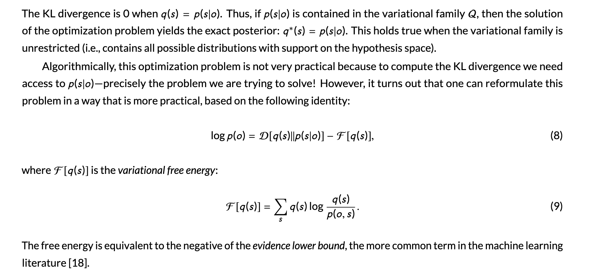
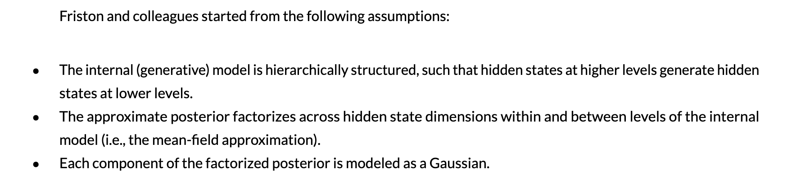
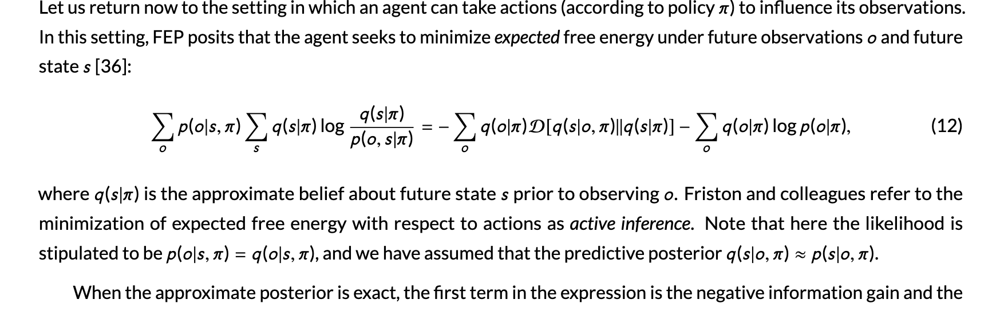
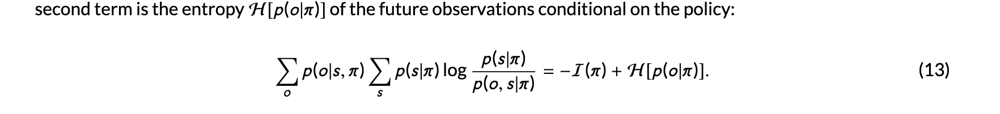
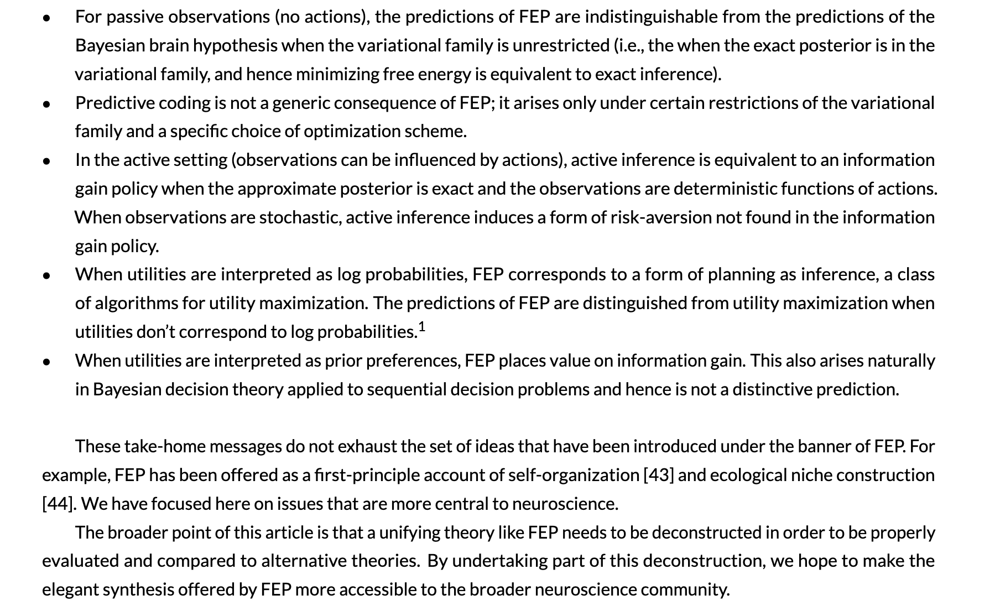

>Gershman, S. J. (2019). What does the free energy principle tell us about the brain?. *Neurons, Behavior, Data analysis, and Theory*, *2*(3), 1-10. https://gershmanlab.com/pubs/free_energy.pdf

## Abstract
The free energy principle has been proposed as a unifying  account of brain function. It is closely related, and in some  cases subsumes, earlier unifying ideas such as Bayesian inference, predictive coding, and active learning. This article clarifies these connections, teasing apart distinctive and  shared predictions.

## 📝 Notes
- Q: What exactly does FEP predict, and what does it not predict?
    - the goal: to identify what FEP's distinvtive theoretical cliams are.
- How to solve?
    - suitable tests of its assumptions
    identify ways to imporve the theory
- What do they focus?
    - be concerned with its credentials as a theory, and pay attention to its specific implementations(process models).
---
### The Bayesian Brain Hypothesis
- “the brain is equipped with an internal (or “generative”) model of the environment, which specifies a “recipe” for generating sensory observations (denoted by o) from hidden states (denoted by s).” ([Gershman, 2019, p. 2](zotero://select/library/items/HR3W5E6K)) ([pdf](zotero://open-pdf/library/items/N6Z5TU6J?page=2&annotation=RA74V44Y))
- two components of the internal model
  - hidden variables are drawn from a prior distribution
  - the sensory observations are drawn from an observation distribution conditional on the hidden state
- “This encoding process might be noisy (due to stochasticity of neural firing) or ambiguous (due to the optical projection of three dimensions onto the two-dimensional retinal image),” ([Gershman, 2019, p. 2](zotero://select/library/items/HR3W5E6K)) ([pdf](zotero://open-pdf/library/items/N6Z5TU6J?page=2&annotation=UKCX73NF))
- “the the prior and the likelihood are combined to infer the hidden state given the observations, as stipulated by Bayes’ rule:” ([Gershman, 2019, p. 2](zotero://select/library/items/HR3W5E6K)) ([pdf](zotero://open-pdf/library/items/N6Z5TU6J?page=2&annotation=47MRNTB2))
- “an agent can influence its observations by taking actions according to a policy π” ([Gershman, 2019, p. 3](zotero://select/library/items/HR3W5E6K)) ([pdf](zotero://open-pdf/library/items/N6Z5TU6J?page=3&annotation=2BEFXSDE))
- “We will not evaluate the empirical validity of the (approximate) Bayesian brain hypothesis, focusing instead on more conceptual issues related to the free energy principle.” ([Gershman, 2019, p. 3](zotero://select/library/items/HR3W5E6K)) ([pdf](zotero://open-pdf/library/items/N6Z5TU6J?page=3&annotation=278CNHPS))
- “a Bayesian agent will convert prior beliefs into posterior beliefs in accordance with Bayes’ rule.” ([Gershman, 2019, p. 4](zotero://select/library/items/HR3W5E6K)) ([pdf](zotero://open-pdf/library/items/N6Z5TU6J?page=4&annotation=Y5ZDQHDE))
- “The Bayesian brain hypothesis abstracts away from any particular algorithmic or neural claims: it is purely a “computational-level” hypothesis.” ([Gershman, 2019, p. 4](zotero://select/library/items/HR3W5E6K)) ([pdf](zotero://open-pdf/library/items/N6Z5TU6J?page=4&annotation=Y223U7IE))
---
### The Unrestricted Free Energy Principle is Bayesian Inference
- “The basic idea of the FEP is to convert Bayesian inference into an optimization problem (see [17] for a tutorial introduction).” ([Gershman, 2019, p. 4](zotero://select/library/items/HR3W5E6K)) ([pdf](zotero://open-pdf/library/items/N6Z5TU6J?page=4&annotation=YJ8BVCFR))

- “Critically, the identity above implies that minimizing the free energy is equivalent to minimizing KL divergence, since the two must balance each other out to match the marginal likelihood, which is fixed as a function of q . Thus, minimizing free energy when the variational family is unrestricted is equivalent to exact Bayesian inference.” ([Gershman, 2019, p. 4](zotero://select/library/items/HR3W5E6K)) ([pdf](zotero://open-pdf/library/items/N6Z5TU6J?page=4&annotation=CPF2A87U))
- “Optimization of free energy is typically restricted by placing constraints on the variational family” ([Gershman, 2019, p. 5](zotero://select/library/items/HR3W5E6K)) ([pdf](zotero://open-pdf/library/items/N6Z5TU6J?page=5&annotation=8L2F6SVW))
---
### Restricting the Variational Family
- “The widely used “mean-field” approximation assumes that the posterior factorizes across components of s (i.e., dimensions of the state space)” ([Gershman, 2019, p. 5](zotero://select/library/items/HR3W5E6K)) ([pdf](zotero://open-pdf/library/items/N6Z5TU6J?page=5&annotation=WPGWJNE3))
- “One challenge facing applications of the Gaussian approximation is that the free energy is not, in general, tractable (except in the case where the exact posterior is Gaussian). To deal with this issue, a common technique, known as the Laplace approximation, is to use a second-order Taylor series expansion around the posterior mode.” ([Gershman, 2019, p. 5](zotero://select/library/items/HR3W5E6K)) ([pdf](zotero://open-pdf/library/items/N6Z5TU6J?page=5&annotation=SPUQL5ZW))
  - “This replaces the nonlinear free energy with a quadratic function, rendering the free energy tractable.” ([Gershman, 2019, p. 5](zotero://select/library/items/HR3W5E6K)) ([pdf](zotero://open-pdf/library/items/N6Z5TU6J?page=5&annotation=DA49GVVN))
    - limitations:“however, that the Laplace approximation has intriguing implications for the neurobiological implementation of Bayesian inference.” ([Gershman, 2019, p. 5](zotero://select/library/items/HR3W5E6K)) ([pdf](zotero://open-pdf/library/items/N6Z5TU6J?page=5&annotation=YB2VENZ2))
---
### Predictive Coding
- “The Laplace approximation can be used to derive arguably the most influential and distinctive aspect of FEP—predictive coding, according to which feedback pathways convey predictions, and feedforward pathways in the brain convey prediction errors (discrepancies between data and predictions).” ([Gershman, 2019, p. 6](zotero://select/library/items/HR3W5E6K)) ([pdf](zotero://open-pdf/library/items/N6Z5TU6J?page=6&annotation=Y4WDCDDQ))
- The predictive coding was proposed as a theory of efficient coding in neural signals.

- “used the Laplace approximation to approximate the free energy and derive update rules for optimization based on gradient descent.” ([Gershman, 2019, p. 6](zotero://select/library/items/HR3W5E6K)) ([pdf](zotero://open-pdf/library/items/N6Z5TU6J?page=6&annotation=S7ABNZP6))
- NOTE:“predictive coding is not a generic consequence of FEP, or even of FEP with a specific approximation family. It is derived from a combination of assumptions about the internal model (hierarchical organization), the approximation family (factorized and Gaussian), the approximation of the free energy (quadratic around the mode), and the optimization scheme (gradient descent).” ([Gershman, 2019, p. 6](zotero://select/library/items/HR3W5E6K)) ([pdf](zotero://open-pdf/library/items/N6Z5TU6J?page=6&annotation=Q5FPV467))
  - Examples, “some authors have explored variants of FEP that do not invoke predictive coding, or combine it with other neural message passing schemes” ([Gershman, 2019, p. 6](zotero://select/library/items/HR3W5E6K)) ([pdf](zotero://open-pdf/library/items/N6Z5TU6J?page=6&annotation=VRZ9K5YJ))
---
### Active Inference

- “under certain conditions active inference is equivalent to the information gain policy studied in standard Bayesian treatments of information acquisition” ([Gershman, 2019, p. 7](zotero://select/library/items/HR3W5E6K)) ([pdf](zotero://open-pdf/library/items/N6Z5TU6J?page=7&annotation=6637EEPK))
- “active inference prefers actions that produce observations which are both informative and predictable.” ([Gershman, 2019, p. 7](zotero://select/library/items/HR3W5E6K)) ([pdf](zotero://open-pdf/library/items/N6Z5TU6J?page=7&annotation=JVLZKEIW))
- “When the determinism constraint is relaxed, information gain and expected free energy will be substantively different.” ([Gershman, 2019, p. 7](zotero://select/library/items/HR3W5E6K)) ([pdf](zotero://open-pdf/library/items/N6Z5TU6J?page=7&annotation=FNCWZVZD))
---
### Planning As Inference
- “the utility of an outcome is equal to its log prior probability, u(o) = log p(o\`π), usually referred to as its prior preference. (Note that we are conditioning on the policy here to emphasize that the free energy is being computed for a fixed policy.) This leads to a form of planning as inference [40, 41], whereby minimizing free energy optimizes a combination of expected utility (extrinsic value) and information gain (epistemic value).” ([Gershman, 2019, p. 7](zotero://select/library/items/HR3W5E6K)) ([pdf](zotero://open-pdf/library/items/N6Z5TU6J?page=7&annotation=KCL7ANWE))
- “evolution has equipped us with the belief that low utility states are low probability, due to the fact that if our ancestors spent a lot of time in those states they would be less likely to reproduce.” ([Gershman, 2019, p. 7](zotero://select/library/items/HR3W5E6K)) ([pdf](zotero://open-pdf/library/items/N6Z5TU6J?page=7&annotation=MNWJ5IQ7))
- “planning as inference can be understood as a notational variant of Bayesian decision theory, provided the utilities and probabilities coincide (free energy theorists typically stipulate that they coincide).” ([Gershman, 2019, p. 7](zotero://select/library/items/HR3W5E6K)) ([pdf](zotero://open-pdf/library/items/N6Z5TU6J?page=7&annotation=K6ULX7DT))
---
### Conclusions

