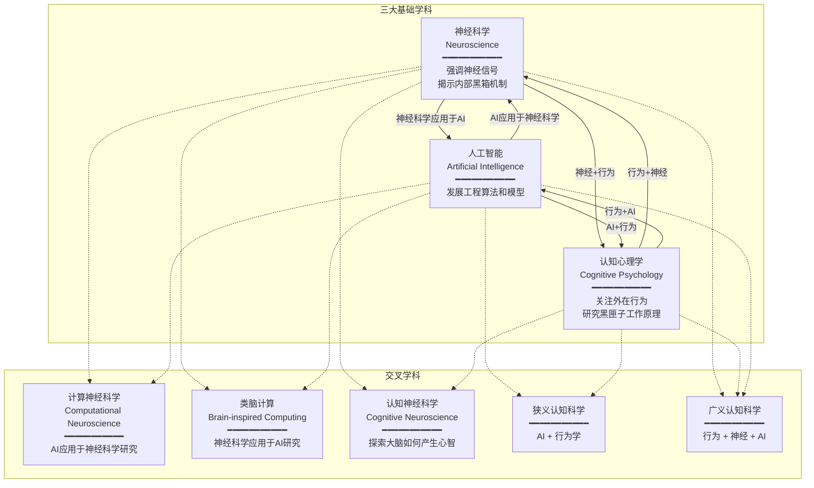
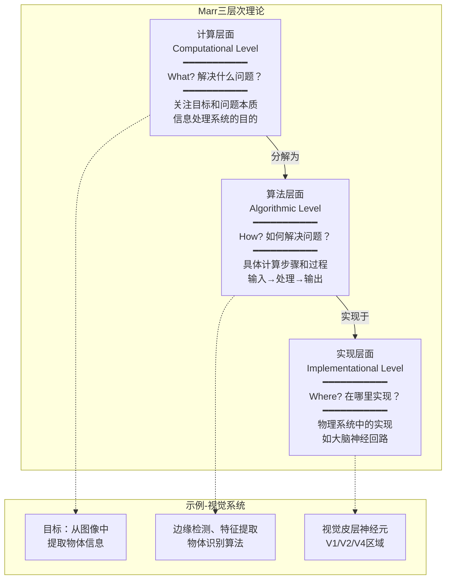

## 1.1 交叉学科三角
- 计算认知神经科学并非一开始就作为独立学科存在，它的发展融合了认知心理学（Cognitive Psychology）、神经科学（Neuroscience）以及人工智能（Artificial Intelligence, AI）三个主要学科，形成了一个交叉学科的三角关系。
- 什么是认知心理学？简单来讲就是把人类比成计算机，假定人输入信息，然后研究这个黑匣子的工作原理。其目标在于解释人的心理现象，尤其是认知功能。
- 神经科学的最终目标：
  - 了解电信号如何通过神经回路产生思维
    - 即，我们如何感知、行动、思考、学习和记忆
- 认知神经科学是研究知觉和认识过程的学科，旨在探索有形大脑如何产生无形心智的思维和想法。
- 人工智能的"智能"被其视为在实现目标过程中的计算能力。
- 计算神经科学(Computational Neuroscience):人工智能应用于神经科学研究
- 类脑计算(Brain-inspired Computing): 神经科学应用于人工智能研究

### 学科关系图

- 神经科学：强调神经信号，旨在揭示内部黑箱的机制
- 认知心理学：关注外在行为
- 人工智能：发展工程算法和模型
- 狭义认知科学：AI + 行为学（抛开底层神经科学）
- 广义认知科学：行为 + 神经 + AI 三个方面
---
## 1.2 认知科学特点
> *"思想是结果，而非原因。“ -- Daniel Dennett*
- 定义：理解人类思维的本质
- 显著特征：多学科的交叉融合
---
## 1.3 认知科学的发展历史
- 随着计算机技术的兴起和跨学科研究的深入，认知科学迎来了重要的发展时期。David Marr在这个时代背景下提出了著名的认知科学的三层次假设，这为统一认知科学框架提供了基础。他强调认知科学必须成为一个交叉学科，这一观点对认知科学的发展产生了深远影响。
  - Marr的理论将认知过程分解为三个层次：计算层面（Computational level）、算法层面（Algorithmic level）和实现层面（Implementational level）。
    - 在计算层面，研究者关注信息处理系统的目标和问题的本质，即系统试图解决的问题是什么。
    - 算法层面则涉及实现这些目标所需的具体计算步骤和过程。
    - 实现层面则关注这些计算是如何在物理系统中，如大脑中实现的。
- Marr的理论不仅为认知科学提供了一个分析和理解心智过程的框架，而且促进了心理学、神经科学、人工智能和哲学等多个学科之间的交叉融合。他的工作为认知科学领域奠定了坚实的基础，并激发了后续研究者对视觉、记忆、语言和思维等领域的深入探索 。

**Marr 三层次关系图**

**In Conculsions:**
| 层面 | 核心问题 | 研究焦点 | 对应学科 |
|------|----------|----------|----------|
| 计算层面 | What? | 目标与问题本质 | 认知心理学、哲学 |
| 算法层面 | How? | 计算步骤与过程 | 人工智能、计算机科学 |
| 实现层面 | Where? | 物理实现机制 | 神经科学 |
---
## 1.4 我们为什么需要计算认知
### 1.4.1 认知科学的基础假设：信息处理理论
#### 1.4.1.1 符号主义
- 符号主义的局限性：然而，面对“不良设定问题”（ill-posed problems）时，基于规则的系统则显得力不从心。这类问题往往缺乏明确的初始条件或规则，或者其解决方案不唯一，如语音识别、语言翻译和物体识别等任务。
- 因此，模拟大脑的信息处理方式来应对复杂、多变和不确定的问题曾为必要性，这也是连接主义兴起的原因之一。
#### 1.4.1.2 连接主义
- 连接主义以神经网络模型为基础，旨在解释和模拟人类大脑的信息处理机制。通过模仿大脑的生物结构，连接主义认为人类的认知过程可以通过一个由大量简单计算单元（类似于神经元）组成的网络来实现。这些计算单元通过加权连接相互作用，并通过学习算法调整权重，从而使整个网络能够完成复杂的信息处理任务。简而言之，认知是神经网络中并行分布式处理的结果。
  - 这也是当前人工神经网络模型可以做为认知过程解释的其中理论基石吧。
- Clark 的研究促使认知科学更加关注身体在认知中的作用，例如身体的运动和感觉如何影响学习和决策。
- PDP模型(Parallel Distributed Pocessing)三个主要特点：
  - 输入器检测信号，输出器活动响应；
  - 输入-输出关系由连接权重决定，通过学习规则调整；
  - PDP模型中的人工神经网络具备自学习能力，能够通过观察大量示例数据调整权重，从而学习如何执行特定任务。
- 反向传播算法是一种有效训练多层感知机的方法，通过计算误差梯度并将其反向传播来更新网络权重，使得网络能够学习并提升性能。多层感知机指的是具有一个或多个隐藏层的神经网络。
- 与单层感知机不同，多层感知机通过增加隐藏层来处理非线性问题。每层的神经元通过激活函数引入非线性，使网络能够拟合更复杂的函数。
- 端到端学习（End-to-End Learning）：即通过一个统一的模型（如深度神经网络）来自动学习和提取特征，直接从输入到输出进行训练。
  - 在这种方法下，学习过程被统一处理，模型能够自我调整和优化，以完成特定任务。
>*批评者的观点提醒我们，在追求人工智能的过程中，仍然需要保持科学的理性和批判性思考。*
### 1.4.2 挑战与“诞生””
- Pylyshyn进一步强调，使用信念-欲望的术语来解释事物，可能会带来不必要的复杂性。他通过保温瓶的例子质问：“它如何知道要保持热水热、冷水冷？” 这种反问揭示了以信念-欲望体系来解释物理现象的荒谬和多余之处。
### 1.4.3 计算认知的必要性
>*当被问及如何看待认知科学时，Pylyshyn引用了甘地的著名回应---被问到如何看待西方文明时，甘地回答道：“Yes, that would be a good idea.”（是的，那将是个好主意）。这一回答暗示了Pylyshyn对认知科学的观点：认知科学确实有潜力成为一门成熟的科学，但目前它还在发展之中，尚未完全实现这个理想状态。*

