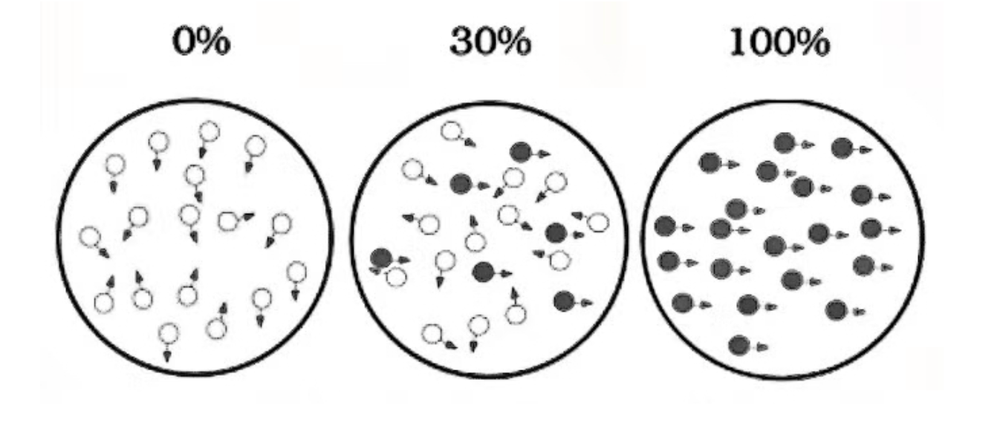
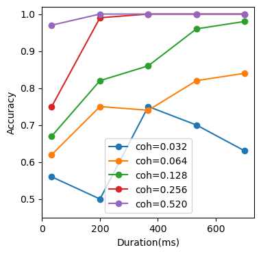
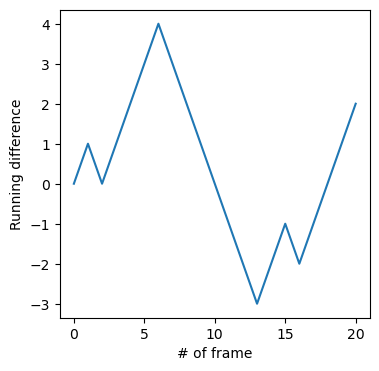
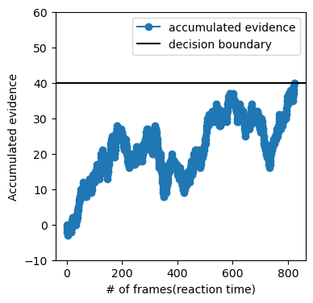
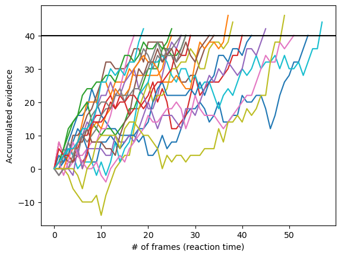
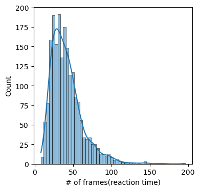

## RDK tasks
- This notebook shows the reproduction of RDK tasks.


- 假设：在观察刺激的过程中，被试逐一统一朝不同方向移动的点的数量，然后比较这些数量以此作出决策。
- 根据这个假设，可以简单的模拟这个过程。


```python
import numpy as np
T = 2
D = 100
f = 0.51
```


```python
from scipy.stats import bernoulli
N_correct = 0
N_wrong = 0
for i in range(T*D):
    dir = bernoulli.rvs(f,size=1)
    N_correct = N_correct + dir
    N_wrong = N_wrong +(1-dir)

if N_correct > N_wrong:
    choice = 1
elif N_correct < N_wrong:
    choice = 0
else:
    choice = bernoulli.rvs(0.5,size=1)
print(choice)
```

    1


```python
# 模拟一次决策
def makeOneDecision(D=100, T=2, f=0.6):
    '''
    <D>: 总共的点数
    <T>: 帧数（刺激持续时间）
    <f>: 向正确方向移动的点所占的比率
    '''
    N_correct = 0
    N_wrong = 0
    for i in range(T*D): # loop 点
        dir = bernoulli.rvs(f, size=1)
        N_correct = N_correct + dir # 正确的点数量+1
        N_wrong = N_wrong + (1-dir) # 错误的点数量+1

    if N_correct > N_wrong:
        accuracy = 1
    elif N_correct < N_wrong:
        accuracy = 0
    else:
        accuracy = bernoulli.rvs(0.5, size=1)
    return accuracy
```


```python
def makeManyDecision(D=100,T=2,f=0.6,nTrial=100):
    decision = np.empty(nTrial)
    for i in range(nTrial):
        decision[i]=makeOneDecision(D,T,f)
    return decision.sum()/nTrial

```

- 随机点的移动方向满足Bernoulli分布，因此，每一帧朝正确方向（假设是右边的）的移动点比例可用数学公式表示为：
$$
f = coh +\frac{1-coh}{2} = \frac{coh}{2} +\frac{1}{2}
$$


```python
nTrial = 1000

coh = np.array([0.032,0.064,0.128,0.256,0.52])
f = (coh+1)/2

dur = np.arange(1,22,5)

print(f)
print(dur)
```

    [0.516 0.532 0.564 0.628 0.76 ]
    [ 1  6 11 16 21]


```python
acc = np.empty((coh.size,dur.size))
for iCoh,cc in enumerate(f):
    for iDur,dd in enumerate(dur):
        acc[iCoh,iDur] = makeManyDecision(D=10,T=dd,f=cc,nTrial=100)
```

    /var/folders/43/vz_pg73s2gb1207961svdg180000gn/T/ipykernel_49578/2609656042.py:4: DeprecationWarning: Conversion of an array with ndim > 0 to a scalar is deprecated, and will error in future. Ensure you extract a single element from your array before performing this operation. (Deprecated NumPy 1.25.)
      decision[i]=makeOneDecision(D,T,f)


```python
import matplotlib.pyplot as plt
label = [f'coh={i:.3f}' for i in coh]
fig = plt.figure(figsize=(4,4))
for iCoh,dd in enumerate(coh):
    plt.plot(dur*1000/30,acc[iCoh,:],'-o',label=label[iCoh])

plt.legend()
plt.ylim([0.45,1.02])
plt.xlabel('Duration(ms)')
plt.ylabel('Accuracy')


```


    Text(0, 0.5, 'Accuracy')


    

    


---

## Decision-Making & RT Simulation
- 为了更全面地理解被试决策过程，我们引入在知觉决策领域中最常见的模型DDM。
    - DDM是一种证据积累模型，模型假设在决策过程中，个体会从环境中连续的获取信息，这些信息被视为“证据”。这些证据以随机但有方向性的方式积累，逐渐接近决策边界。
- 在这一节中，我们尝试通过在每一帧中，计算向正确方向运动的点的数量和向错误方向运动的点的数量差，最后累加每一帧中所得到的差值delta。


```python
import numpy as np
from scipy.stats import bernoulli 
import matplotlib.pyplot as plt

```


```python
T = 20
D = 10
f = 0.55

N_correct = 0
N_wrong = 0

delta = np.empty(T+1)
delta[0] = 0

for t in range(T):
    dir = bernoulli.rvs(f,size=1)
    N_correct = N_correct + dir
    N_wrong = N_wrong + (1-dir)
    delta[t+1] = N_correct - N_wrong


```

    /var/folders/43/vz_pg73s2gb1207961svdg180000gn/T/ipykernel_49578/1219611270.py:15: DeprecationWarning: Conversion of an array with ndim > 0 to a scalar is deprecated, and will error in future. Ensure you extract a single element from your array before performing this operation. (Deprecated NumPy 1.25.)
      delta[t+1] = N_correct - N_wrong


```python
fig = plt.figure(figsize=(4,4))
plt.plot(range(T+1),delta)
plt.ylabel('Running difference')
plt.xlabel('# of frame')
```


    Text(0.5, 0, '# of frame')


    

    


```python
B = 40 #decision boundary
D = 10
f = 0.55

N_correct = 0
N_wrong = 0

delta = []
delta.append(N_correct - N_wrong)

i = 0
while np.abs(delta[i]) < B:
    dir = bernoulli.rvs(f,size=1)[0]
    N_correct = N_correct +dir
    N_wrong = N_wrong + (1-dir)

    i = i +1
    delta.append(N_correct - N_wrong)
if delta[-1] > 0 :
    print('The answer is correct in this trial')
else:
    print('The answer is wrong in this trial')
RT = i
print(f'Reaction time in this trial is {RT} frames')

```

    The answer is correct in this trial
    Reaction time in this trial is 822 frames


```python
fig = plt.figure(figsize=(4,4))
plt.plot(delta,'-o',label = 'accumulated evidence')
plt.axhline(B,color='k',label='decision boundary')
plt.ylabel('Accumulated evidence')
plt.xlabel('# of frames(reaction time)')
plt.ylim([-10,60])
plt.legend()
```


    <matplotlib.legend.Legend at 0x17769d590>


    

    


```python
def ddm1(D=10, f=0.55, B=40):
    # <D>: 总点数
    # <f>: 向正确方向移动的点的比例
    # <B>: 决策边界

    i = 0
    N_correct = 0
    N_wrong = 0
    delta = [] # 将delta设为一个列表
    delta.append(N_correct - N_wrong)

    while np.abs(delta[i]) < B:
        for j in range(D):
            # 取样这个点的移动方向
            dir = bernoulli.rvs(f, size=1)[0] 
            # 更新计数
            N_correct = N_correct + dir
            N_wrong = N_wrong + (1-dir)
        
        # 增加一帧
        i = i + 1
        # 计算差异
        delta.append(N_correct - N_wrong)

    correct = (delta[-1]>0) #正确与否
    RT = i # 反应时
        
    return correct, RT, delta # 返回正确与否，反应时，整个证据积累的过程
```


```python
nTrial = 20
for i in range(nTrial):
    _,_,delta = ddm1(D=10,f=0.55,B=40)
    plt.plot(delta)
plt.axhline(B,color='k',label='Decision boundary')
plt.xlabel('# of frames (reaction time)')
plt.ylabel('Accumulated evidence')
```


    Text(0, 0.5, 'Accumulated evidence')


    

    


```python
from seaborn import displot, histplot
from scipy.stats import gamma

nTrial = 2000 # 试次数

RT = np.empty(nTrial)

for i in range(nTrial): # 循环多个试次
    _,RT[i],_ = ddm1(D=10, f=0.55, B=40)
    
# 我们可视化出反应时的分布
#displot(RT, hist=True, kde=True)
from seaborn import displot, histplot
plt.figure(figsize=(4,4))
histplot(RT, kde=True)
plt.xlabel('# of frames(reaction time)')
plt.ylabel('Count')
```


    Text(0, 0.5, 'Count')


    

    

