# Neural Dynamics and Computational Models

## Overview

This note reorganizes the main ideas from a lecture on neural dynamics into a cleaner study-note format for a learning website. The central question is simple: **how do patterns of neural activity arise from network structure, and how do those patterns support computation, memory, and behavior?**

Two guiding questions run through the whole topic:

1. **How is neural activity generated and maintained over time?**
2. **How should connections change in response to activity?**

The first question is the focus here.

---

## Why This Topic Matters

Computational neuroscience tries to turn many scattered experimental findings into a more unified explanation. Instead of only describing what neurons do, it asks why certain patterns appear and what kind of circuit structure can produce them.

This is also where neuroscience and artificial intelligence meet. Artificial neural networks borrow some ideas from the brain, but brain circuits contain rich recurrent structure that is often missing from simpler feedforward models. Studying neural dynamics helps us understand what those recurrent circuits contribute.

---

## Why Recurrent Networks Matter

Many brain circuits are not organized as one-way pipelines. Neurons send signals back to one another through loops of excitation and inhibition. Because of this, activity can:

- persist after an input disappears,
- settle into stable internal states,
- move smoothly across representational space,
- and support memory-like or navigation-like computations.

That is why recurrent neural networks are a natural starting point for studying neural dynamics.

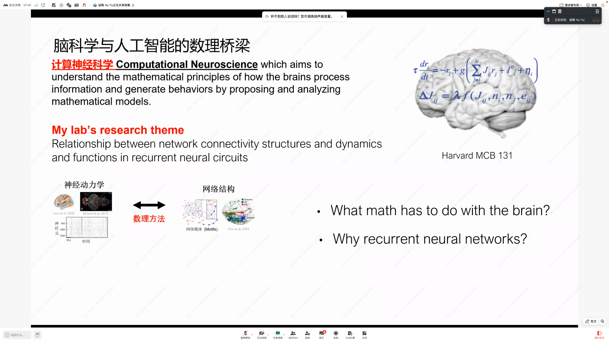
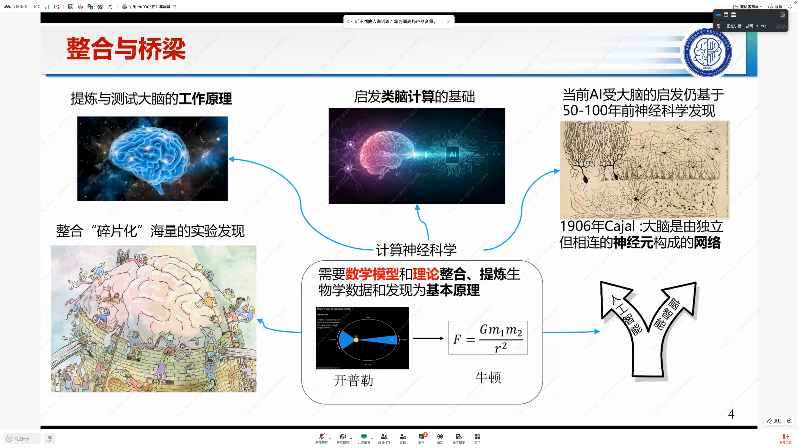

---

## A Key Example: Grid Cells

One classic example comes from **grid cells** in the medial entorhinal cortex. When an animal explores an open space, some neurons fire at multiple locations that form a striking hexagonal pattern.

This is important because the pattern is highly regular, but not easy to explain by intuition alone. It is easy to imagine a neuron that responds to one place. It is much harder to explain why the brain should generate a repeating hexagonal code across space.

That makes grid cells a strong motivation for building mathematical models.

---

## Start Simple: The Ring Network

Before moving to two-dimensional spatial coding, it helps to begin with a simpler model: the **ring network**.

In a ring network, neurons are arranged along a circular variable. The key assumption is **translation-invariant connectivity**:

- neurons at different positions are wired in the same pattern,
- no point on the ring is special,
- shifting the whole activity pattern does not change the basic logic of the network.

Each neuron's activity changes over time based on:

- recurrent input from other neurons,
- external input,
- and a nonlinear conversion from input to firing rate.

This gives a simple but powerful model of how structured activity patterns can emerge from local interaction rules.

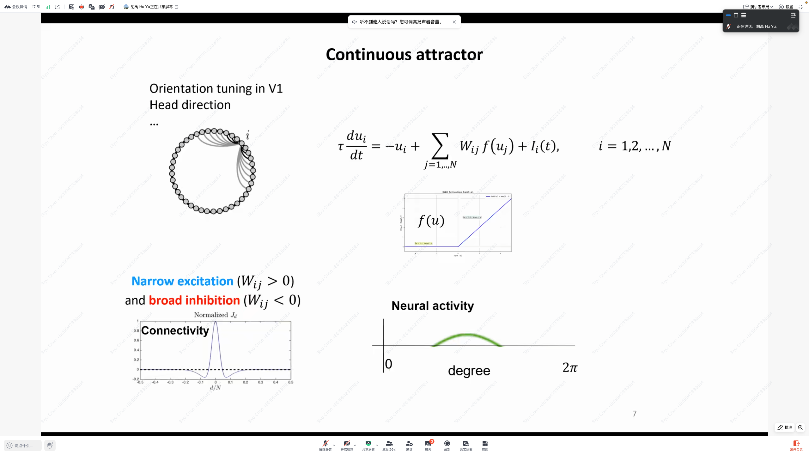
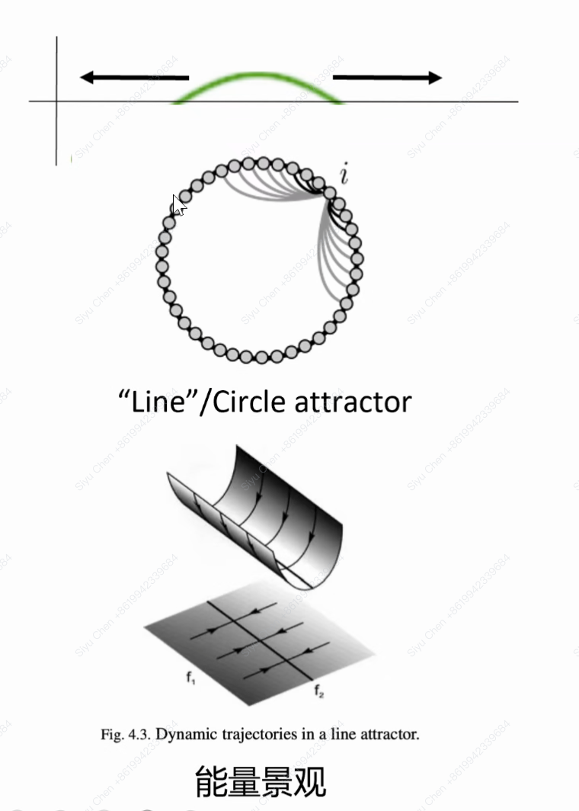
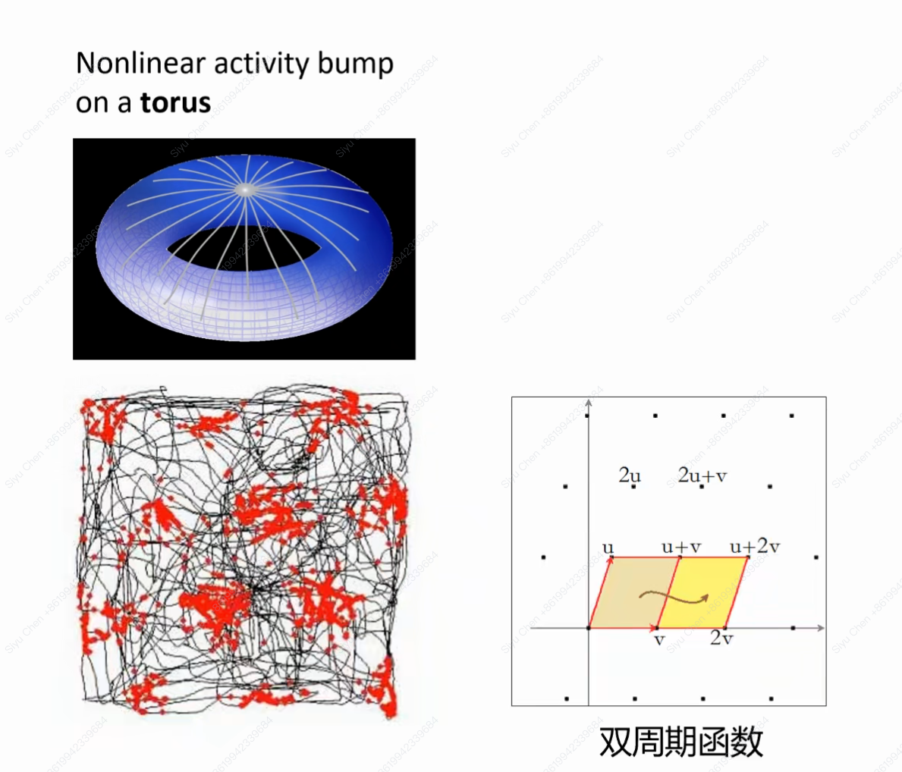

---

## Bump Activity

One of the most important activity patterns in a ring network is **bump activity**. In this state, only a local group of neurons stays strongly active, while the rest are much less active.

This matters because it shows how a circuit can hold a compact internal representation instead of activating everything at once.

### What Makes a Bump Stable

The standard condition is:

- **strong local excitation**, which supports nearby neurons,
- **broader inhibition**, which suppresses more distant neurons.

This pattern is often called **Mexican-hat connectivity**. It allows one localized active region to survive while preventing the whole network from lighting up.

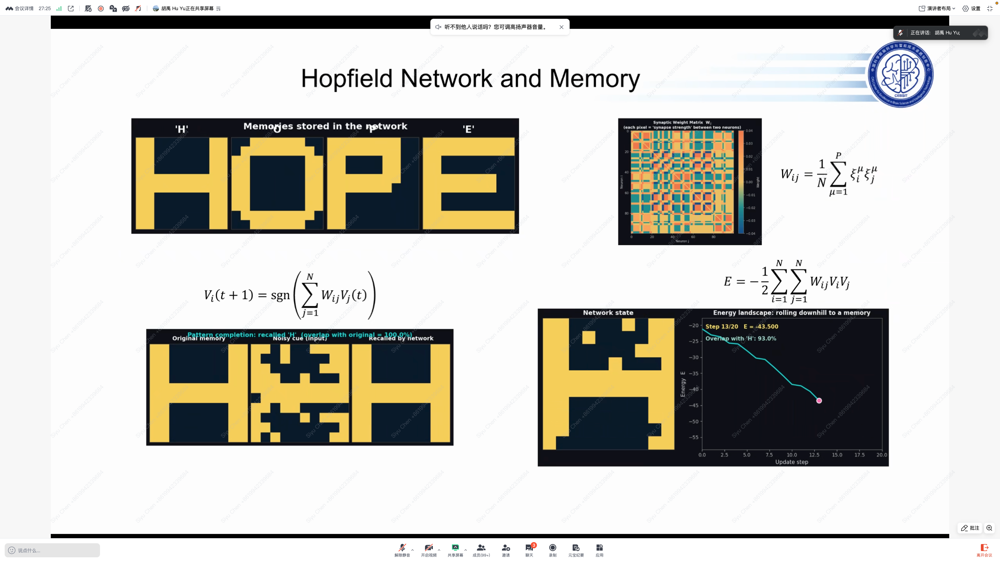

---

## Continuous Attractors

Because the ring is symmetric, the bump does not need to stay at one fixed place. It can sit anywhere on the ring and still remain stable.

That creates a family of equally valid states, which leads to the idea of a **continuous attractor**.

A useful intuition is a flat valley:

- the system is pulled into the valley,
- it stays stable inside the valley,
- but it can still slide smoothly along the valley.

In this model, the bump position tells us where the network sits along that continuous internal variable.

---

## Why the Ring Model Is Useful

The ring network illustrates three big ideas:

1. recurrent circuits can create a localized representation,
2. that representation can move continuously while staying stable,
3. the represented variable is periodic, so the pattern wraps around naturally.

This makes the ring model useful for variables such as head direction, orientation, or one-dimensional position.

---

## From Ring Networks to Grid Cells

Now imagine the bump shifts as the animal moves:

- if the animal moves one way, the bump shifts one way;
- if the animal moves the other way, the bump shifts back.

A single neuron fires whenever the moving bump passes through its preferred position. If we record where that neuron fires in the world, we get a repeating spatial pattern.

So even the one-dimensional ring model already behaves like a simple repeating spatial code.

To model real grid cells, the same idea is extended into **two dimensions**. Instead of a one-dimensional ring, the internal representation becomes a doubly periodic two-dimensional space. Under the right connectivity pattern, the network produces a two-dimensional continuous attractor, and grid-like firing appears naturally.

---

## Why the Pattern Becomes Hexagonal

An important question is why grid-cell firing tends to look **hexagonal** instead of square.

Within the continuous-attractor view, the answer comes from the geometry of two-dimensional periodic structure. When the repeating directions are arranged in the right way, the most natural lattice is hexagonal. A square pattern would require a more special arrangement.

So the hexagon is not just a visual curiosity. It follows from the geometry of the internal representation.

---

## Why This Model Is Appealing

The continuous-attractor account is still a theoretical explanation, not a final proven answer. But it is attractive because it offers:

- **stability**, since the network can maintain internal states,
- **robustness**, since the code can survive partial disruption,
- **error correction**, since the dynamics can help pull noisy states back into a coherent pattern.

These are strong reasons why this framework remains influential.

---

## What Would Stronger Evidence Look Like

To test the theory more directly, we would want structural evidence showing that the real circuit is wired in the approximately symmetric way the model requires.

In other words, the most convincing support would come from linking:

- observed firing patterns,
- measured circuit connectivity,
- and model predictions.

This is why detailed circuit reconstruction is so important for this topic.

---

## A Brief Note on Population Coding

This topic also teaches a broader lesson: neural information is often carried by **populations**, not by isolated single neurons.

That means understanding the brain requires more than asking what one neuron prefers. We also need to understand how neurons work together as a structured dynamic system.

---

## A Brief Note on Hopfield Networks

Another important example in neural dynamics is the **Hopfield network**. It was not the main focus here, but it belongs to the same larger family of ideas:

- recurrent circuits can create stable internal states,
- those states can function like memory,
- and network structure can explain computation at the population level.

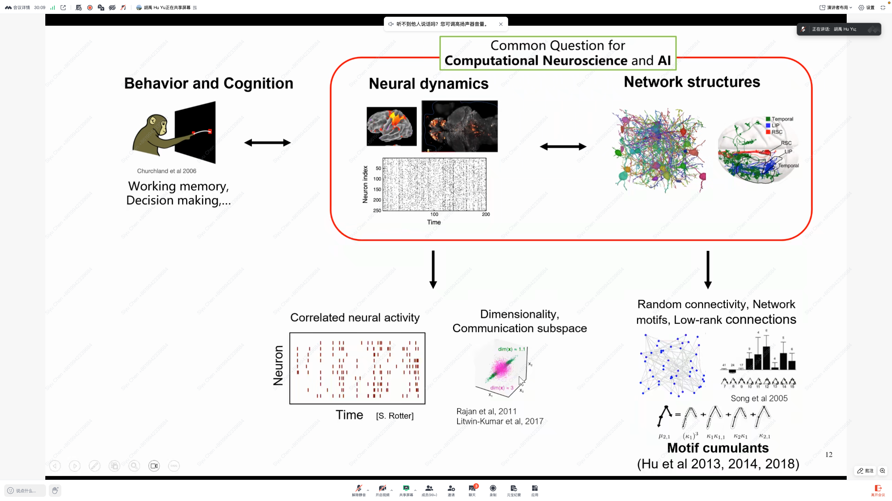
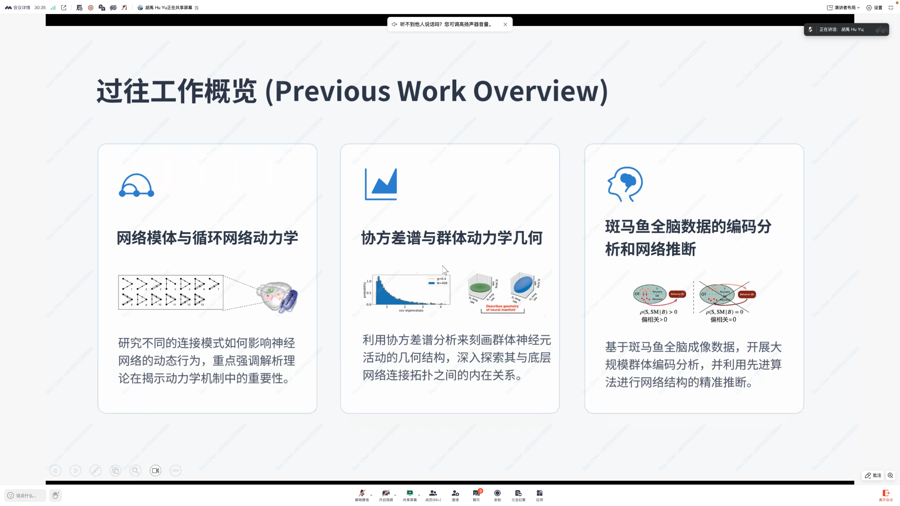
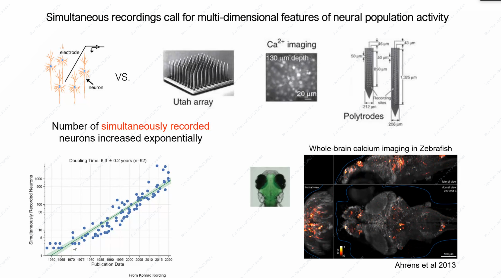
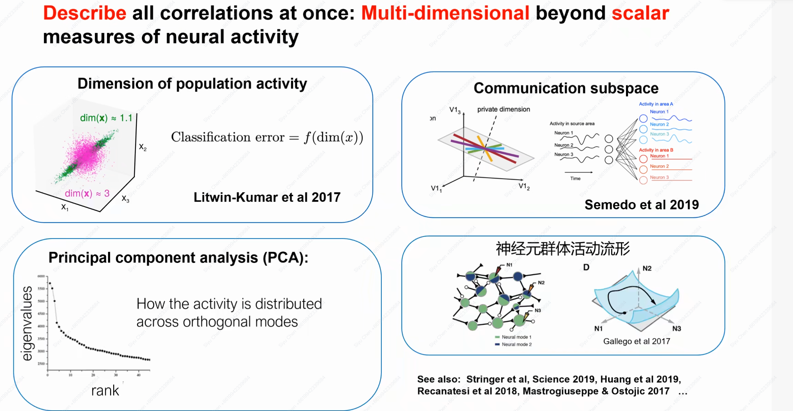
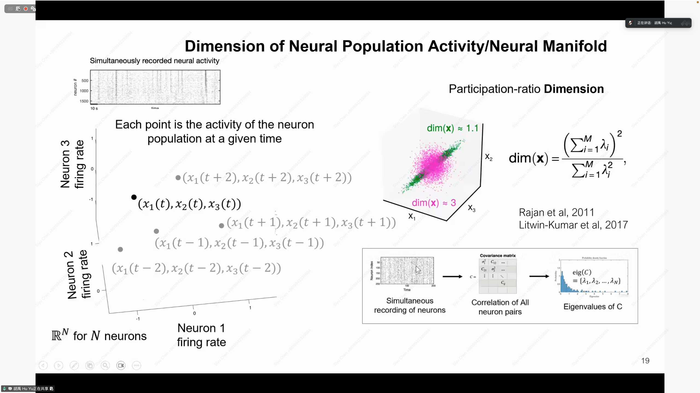
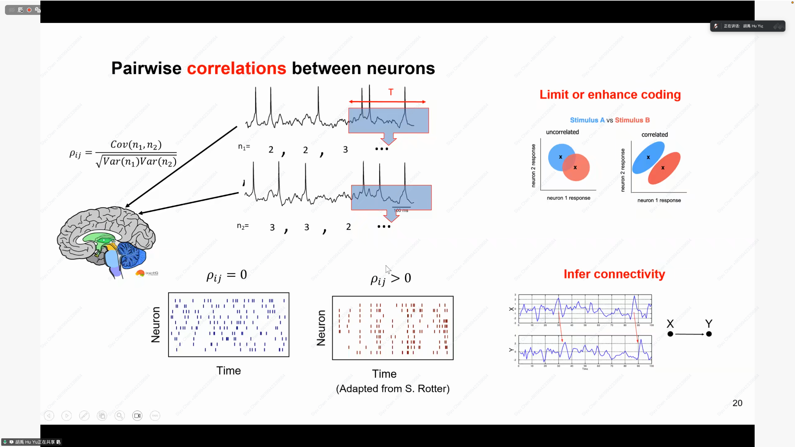

---

## Key Takeaways

- Neural activity is shaped by circuit structure rather than appearing at random.
- Recurrent connectivity can generate stable, interpretable, and moving activity patterns.
- Ring networks provide a simple model for localized activity bumps.
- Continuous attractors explain how internal representations remain stable while still moving smoothly.
- Extending this logic to two dimensions gives a compelling explanation for grid-cell firing and its hexagonal layout.

This is why neural dynamics is so central in computational neuroscience: it connects circuit structure, mathematical explanation, and cognitive function in one framework.

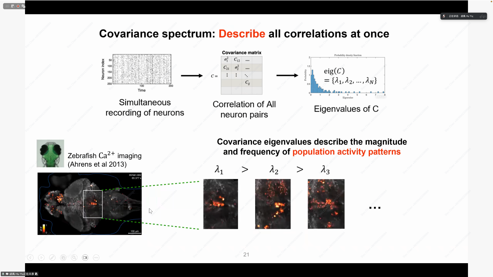
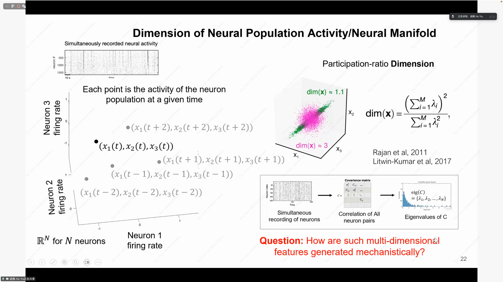
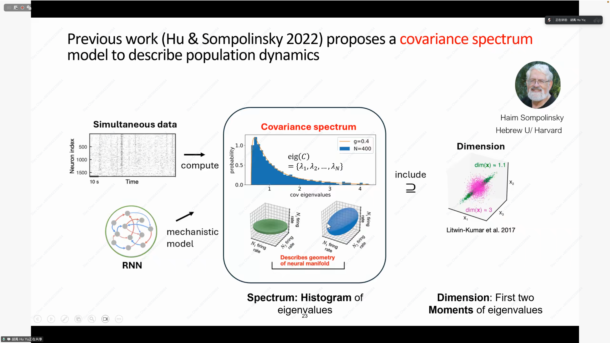
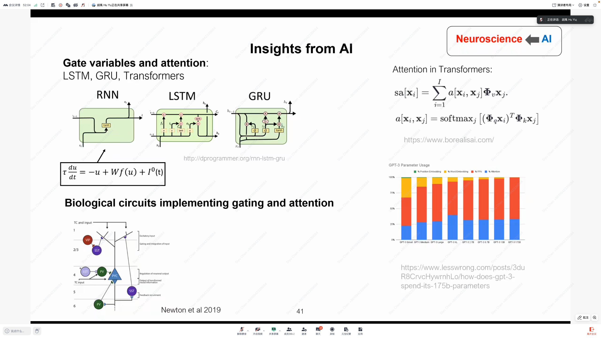

