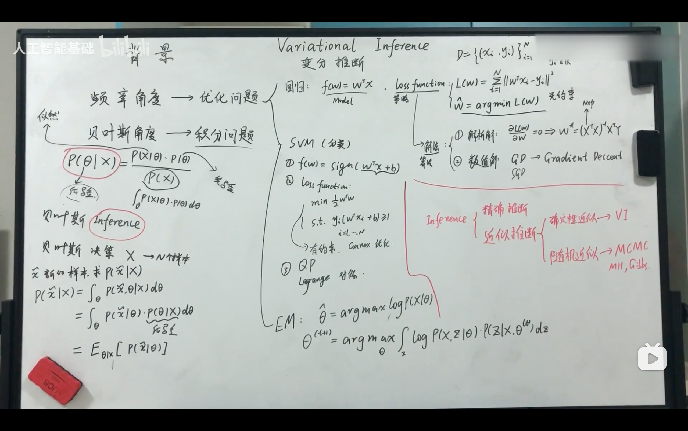
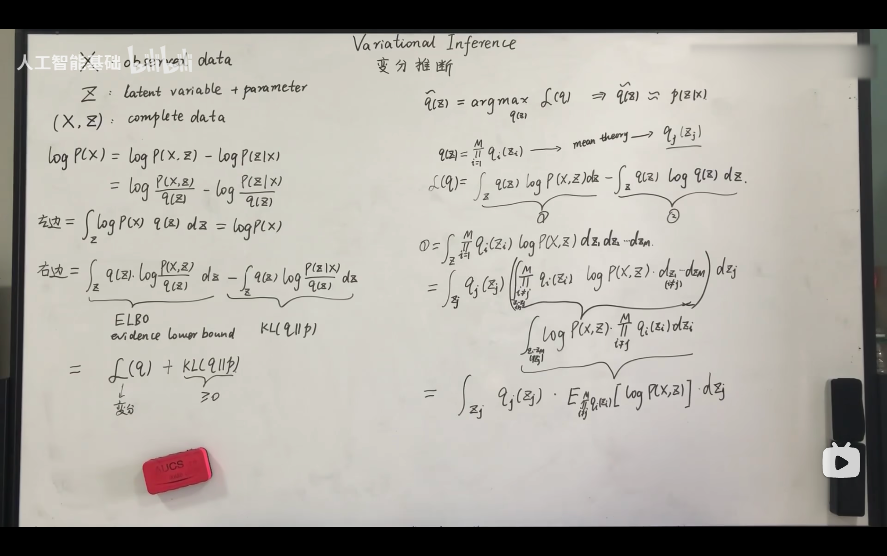
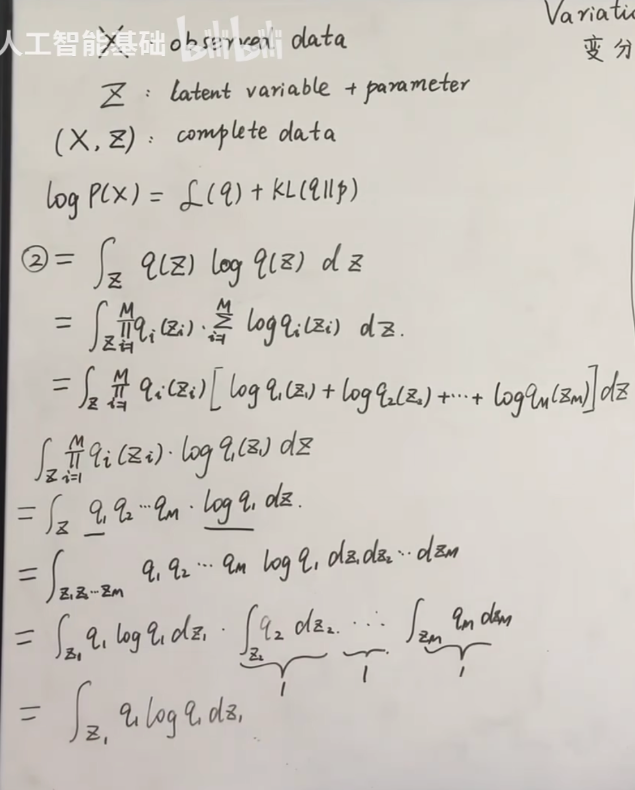
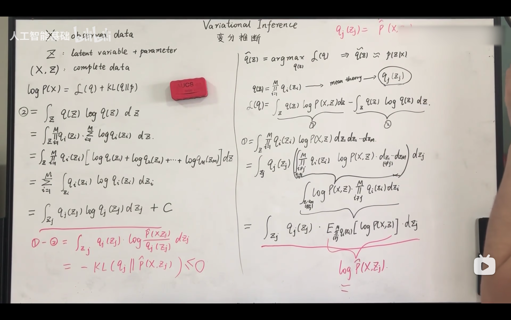
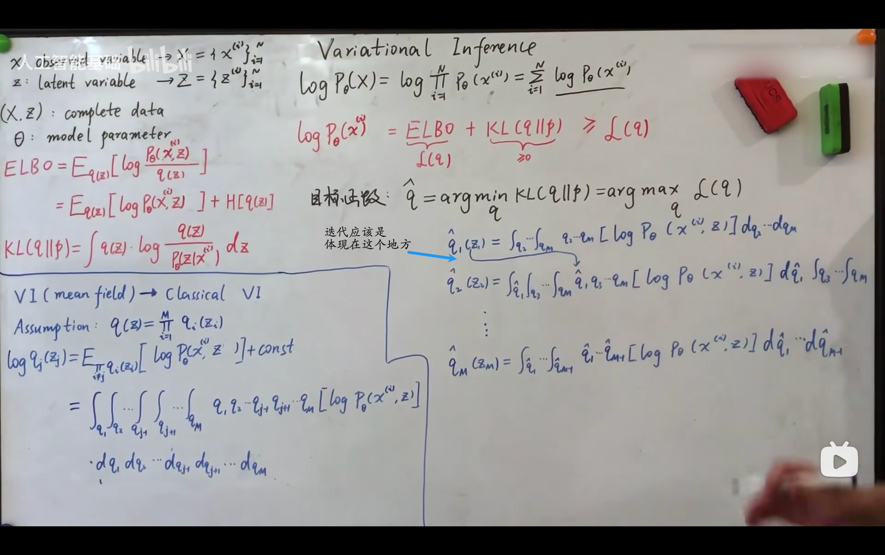

## Intro

- 频率角度 -> 优化问题
  - 回归问题：数据拟合, Loss Function(无约束)
    - 解法
      - 解析解
      - 数值解：Gradient Decent
  - 分类问题：SVM, Loss Function(有约束)
    - 解法
      - QP
      - lagrange 对偶
  - EM算法：Expectation-Maximization Algorithm
- 贝叶斯角度 -> 积分问题
- 先通过Bayesian Inference得到后验分布,再根据后验分布进行决策。
- 我们关心的是整个后验分布的期望和方差。

### 如何求Inference？

- 精确推断
- 近似推断
  - 确定性近似 -> VI
  - 随机近似 -> MCMC

---
## Formula Derivation
- 两边同时对q(z)求期望
- 想找到q(z)近似于后验分布p(z|x)
  - 即q(z) = argmax_q(z) L(q)
    - 即有q(z) 约等于 p(z|x)
- 统计物理学的平均场理论（Mean Field Approximation） ，用于简化复杂的后验分布。
  - 核心假设：待近似的后验分布q(z)可以分解为多个独立分布的乘积：[q(\mathbf{z}) = \prod_{i=1}^M q_i(z_i)]其中 z = ( z_{1}, z_{2}, … , z_{M}) 是潜在变量向量，每个q_{i}(z_{i}) 是独立的边际分布。
> 统计物理学中的 平均场理论（Mean Field Theory, MFT） 是一种简化复杂多体问题的近似方法，核心思想是将系统中每个粒子受到的所有其他粒子的 复杂相互作用 替换为一个 均匀的、平均的"场" ，从而将多体问题简化为单体问题。
- 概率加权平均是根据值出现的概率分配权重，计算所有可能值的加权和/积分，反映了随机变量的“平均表现”或“中心趋势” 。它是概率论中期望的本质，也是连接概率与统计的桥梁。
- 期望是关于概率测度的积分，是积分概念在概率空间中的推广。

- Log里的积分可以写成对Log求和的形式。

  - 这是对于其中一个logq1(z1)进行的推导举例

  - 当且仅当q_{j}(z_{j}) = p(x,z_{j})时，L(q)有最大值为0。
---
## Review
- 变分推断假设了这M个分布是独立的，毫无关联的。
- 因为变分推断关注的是后验，所以可以把theta弱化掉，只关注q(z)。
- 目标函数：q = argmin KL(q(z) || p(z|x)) = argmax_q(z) L(q)
- x和z都是随机变量。
- 澄清：z_{i}代表的是维度，不是样本。x^{i}代表的是第i个样本。    

  - 迭代更新q(z)，直到收敛。
  - 这个实际上也是，**坐标上升法(Coordinate Ascent)**。
    - 与梯度下降类似，但用于**最大化**目标函数
    - 核心思想：**每次只优化一个变量，固定其他所有变量，循环遍历所有变量直到收敛**
    - 更新过程：
      1. 初始化：选择初始点 \( \mathbf{x}^0 = (x_1^0, x_2^0, \dots, x_n^0) \)
      2. 迭代优化：对每个变量 \( x_i \)，固定其他变量，找到使目标函数最大的 \( x_i^* \)
      3. 收敛检查：重复直到函数值变化小于阈值或达到最大迭代次数
    - 更新顺序：可以是**循环顺序**（1→2→…→n→1…）或**随机顺序**
    - 在变分推断中的应用：
      - 称为**坐标上升变分推断(CAVI)**
      - 每次只优化一个潜在变量的分布 \( q_j(z_j) \)
      - 固定其他所有潜在变量的分布 \( q_i(z_i) \ (i \neq j) \)
      - 沿着每个分布维度最大化ELBO，直到收敛

### Limitations: Mean Field Approximation (Classical VI)
- 对于复杂的z不适用（例如神经网络）
- intractable 后验分布
- 无法捕捉变量间的复杂依赖关系
- 可能陷入局部最优
