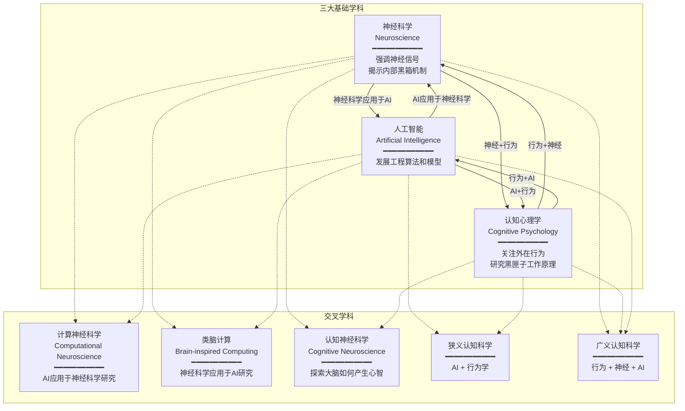

## 1.1 交叉学科三角
- 计算认知神经科学并非一开始就作为独立学科存在，它的发展融合了认知心理学（Cognitive Psychology）、神经科学（Neuroscience）以及人工智能（Artificial Intelligence, AI）三个主要学科，形成了一个交叉学科的三角关系。
- 什么是认知心理学？简单来讲就是把人类比成计算机，假定人输入信息，然后研究这个黑匣子的工作原理。其目标在于解释人的心理现象，尤其是认知功能。
- 神经科学的最终目标：
  - 了解电信号如何通过神经回路产生思维
    - 即，我们如何感知、行动、思考、学习和记忆
- 认知神经科学是研究知觉和认识过程的学科，旨在探索有形大脑如何产生无形心智的思维和想法。
- 人工智能的"智能"被其视为在实现目标过程中的计算能力。
- 计算神经科学(Computational Neuroscience):人工智能应用于神经科学研究
- 类脑计算(Brain-inspired Computing): 神经科学应用于人工智能研究

### 学科关系图

**核心要点：**
- 神经科学：强调神经信号，旨在揭示内部黑箱的机制
- 认知心理学：关注外在行为
- 人工智能：发展工程算法和模型
- 狭义认知科学：AI + 行为学（抛开底层神经科学）
- 广义认知科学：行为 + 神经 + AI 三个方面
---
## 1.2 认知科学特点
